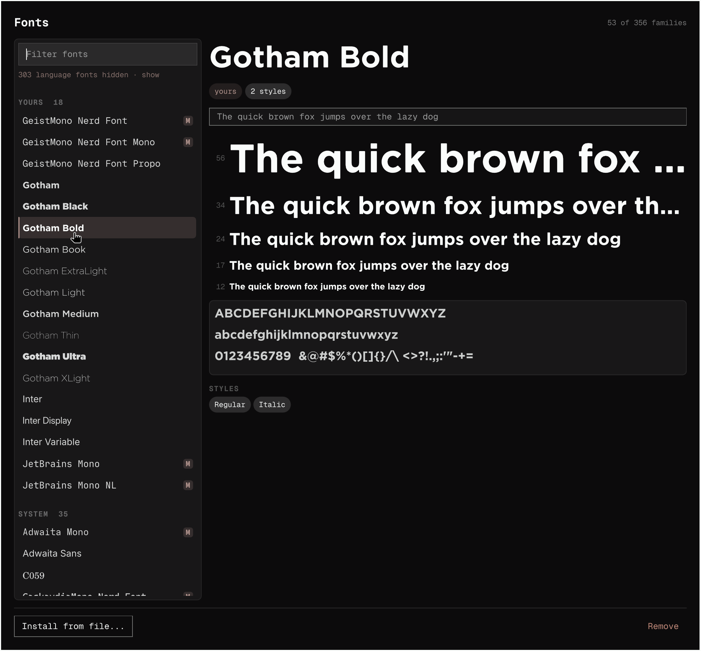

# Fonts

A font manager for the Omarchy shell. See what is installed, preview anything
in its own typeface, install a whole family in one go, and remove the ones you
added.



## Install

```bash
omarchy plugin add https://github.com/OWNER/REPO --enable
```

An **Aa** icon appears in the bar. Click it, or bind a key to:

```bash
omarchy-shell shell toggle nosignal.omafont
```

Optionally, register the double-click handler so opening a font file in your
file manager brings up the panel:

```bash
~/.config/omarchy/plugins/nosignal.omafont/handler/install-handler.sh
```

## Using it

**The list** shows your font families, split into **Yours** — the ones in
`~/.local/share/fonts`, which you can remove — and **System**, which belong to
packages and are preview-only. Each family is set in its own typeface, so the
list shows you fonts rather than a column of names. The filter takes focus as
soon as the panel opens, so just start typing. An `M` marks a monospace family.

**Language fonts are hidden by default.** A typical Arch install carries around
300 Noto families, one per writing system, which buries the forty or so fonts
you would ever deliberately choose. They stay installed — your browser and
terminal need them for Arabic, CJK, Hebrew and emoji — they are just folded out
of the way. A line under the filter says how many are hidden and unfolds them,
and typing a filter searches all of them regardless, so `tamil` still finds the
Tamil fonts.

**The preview** is a type specimen: the name at display size, the styles the
family ships, five size-labelled lines and the full character set. The sample
line is editable — a font is chosen against the words it will actually set.

## Installing fonts

| How | What happens |
|---|---|
| Drop a file, folder or `.zip` on the panel | Everything installable inside it is staged |
| **Install from file…** | Same, through a file picker |
| Double-click a font in your file manager | Opens the panel with that font staged |

Staged fonts are previewed **before** anything is written, and the panel lists
every family and face it is about to install, and where. Press `Enter` or click
**Install** to go ahead.

A downloaded family is rarely one file, so a folder or a `.zip` installs whole.
Packs often ship the same faces as both OTF and TTF; when that happens you get
a toggle to pick one or take both, because the two formats frequently disagree
about family names and cannot be merged reliably.

Fonts land in `~/.local/share/fonts/<Family>/`. No password is needed.

**Applications already running will not see a new font until they restart.**
That is fontconfig, not this plugin — every font manager on Linux behaves this
way. New windows pick it up immediately.

## Browsing free fonts

The **Browse** tab installs open-licence fonts without leaving the panel: about
2100 families from [Fontsource](https://fontsource.org) — a repackaging of
Google Fonts and friends, all under OFL, Apache, UFL, MIT or Unlicense — and
the 73 family archives published by
[Nerd Fonts](https://github.com/ryanoasis/nerd-fonts).

**Nothing is downloaded until you ask for it.** Opening the panel fetches
nothing at all. The Browse tab tells you what the two lists cost before you
load them (roughly 600 KB, cached for a day), and no font is fetched until you
pick one.

Selecting a family fetches a single face, about 50 KB, and shows you a real
specimen. Nerd Fonts publish their faces only inside the release archives, so
there is nothing small to preview; where the family is a patched version of a
font Fontsource also carries, the unpatched original is shown and labelled as
such, and where it is not, the panel says so rather than showing you nothing.

**Install** takes Regular, Bold and their italics — filtered to what the family
actually ships — or **every weight** if you want the lot. Nerd Fonts download
their whole archive; the size is on the row before you click.

Fonts are fetched from `cdn.jsdelivr.net` and `github.com`, pinned to an exact
published version rather than a moving `latest`, and anything that arrives has
to parse as a font before it goes near your font directory. No request is made
to Google.

## Removing fonts

Select a family under **Yours** and click **Remove**. It deletes that family's
files and prunes the empty folder. It will only ever touch
`~/.local/share/fonts`; system fonts cannot be removed from here.

## Setting your terminal font

Select a monospace family — the ones marked `M` — and click **Set as terminal
font**. This hands off to Omarchy's own `omarchy-font-set`, so your terminal
configs and the system monospace alias are updated the same way the built-in
command does it.

## Keys

| | |
|---|---|
| `Esc` | clears the filter, then closes |
| `Enter` | installs a staged font |
| `/` | jump to the filter |
| `r` | rescan |

## Removing the plugin

```bash
omarchy plugin remove nosignal.omafont
```

If you registered the double-click handler:

```bash
rm -f ~/.local/bin/omafont-open ~/.local/share/applications/omafont.desktop
update-desktop-database ~/.local/share/applications
```

Fonts you installed stay in `~/.local/share/fonts` — removing the plugin does
not touch them.

## Requirements

| | |
|---|---|
| `fontconfig` | `fc-list`, `fc-scan`, `fc-cache` — present on any Omarchy install |
| `jq` | one-time registration in `shell.json` — already an Omarchy dependency |
| `unzip` | only to install from a `.zip` |
| `zenity` | **optional** — adds the *Install from file…* button. Without it, use drag-and-drop or the double-click handler |

Nothing runs with elevated privileges. The plugin writes only to
`~/.local/share/fonts`, its own cache in `~/.cache/omafont`, and — if you
register the handler — `~/.local/bin` and `~/.local/share/applications`.
Network access is used only by the Browse tab, and only when you ask it to
fetch something.

## Licence

MIT — see [LICENSE](LICENSE).
